= dremio installation on EKS

'''

Version : 1.0.0 + date : 2024/06/18 +

'''

image::https://university.dremio.com/asset-v1:dremio+DCE3+2019+type@asset+block@gnarly-aws-eks.png[]

== Introduction

This github repository show a simple step by step EKS ckuster creation and a Dremio installation on it.

== Pre-requisites

. Laptop with a Linux, Windows or Macbook.
. A modern browser.
. Wifi Internet connection.
. https://www.docker.com/products/docker-desktop/[Docker Destop] or https://podman-desktop.io/[Podman Desktop] installed

== Step 1: Setup docker image

We are going to use a docker image https://hub.docker.com/r/alpine/k8s[alpine/k8s].
This image brings all needed tools for creating the EKS cluster and install Dremio on it :

____
https://github.com/helm/helm[helm] +
https://kubernetes.io/docs/tasks/tools/install-kubectl/[kubectl] +
https://github.com/aws/aws-cli[awscli]
____

[,console]
----
docker pull alpine/k8s:1.27.13
docker run -i -t alpine/k8s:1.27.13 bash
----

[,console]
----
podman pull alpine/k8s:1.27.13
podman run -i -t alpine/k8s:1.27.13 bash
----

== Step 2: AWS configure

{blank}

=== Configuring specific roles

{blank}

You need to create 2 roles with these policy configuration.
For the first role (bj-eks-node-role in our example), here it is the configuration :

{blank}

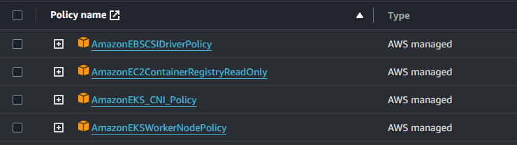

{blank}

Create a customer managed policy like this :

{blank}

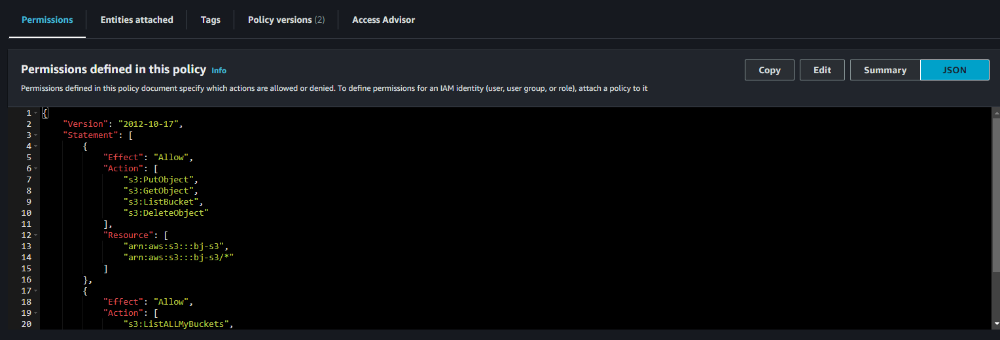

{blank}

[,json]
----
{
    "Version": "2012-10-17",
    "Statement": [
        {
            "Effect": "Allow",
            "Action": [
                "s3:PutObject",
                "s3:GetObject",
                "s3:ListBucket",
                "s3:DeleteObject"
            ],
            "Resource": [
                "arn:aws:s3:::bj-s3",
                "arn:aws:s3:::bj-s3/*"
            ]
        },
        {
            "Effect": "Allow",
            "Action": [
                "s3:ListALLMyBuckets",
                "s3:GetBucketLocation"
            ],
            "Resource": "*"
        }
    ]
}
----

For the second role (bj-eksClusterRole in our example), here it is the configuration :

{blank}

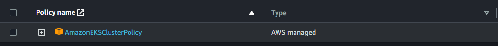

{blank}

=== Configuring AWS 

{blank}

On the docker image bash, launch :

[,console]
----
aws configure
----
{blank}

please fill up the values according your aws credentials :

____
AWS Access Key ID [None]: +
AWS Secret Access Key [None]: +
Default region name [None]: +
Default output format [None]:
____

Verify that parameters has been taken in account :

[,console]
----
aws sts get-caller-identity
{
    "Account": "XXXXXXXXXXX",
    "UserId": "XXXXXXXXX",
    "Arn": "arn:aws:iam::622194627903:user/XXXXXXXX"
}
----

== Step 3: Create EKS cluster

We are going to use AWS console home UI.

____
Name : dremio-eks-cluster +
Kubernetes version : 1.29 +
Cluster service role : bj-eksClusterRole +
____

{blank}

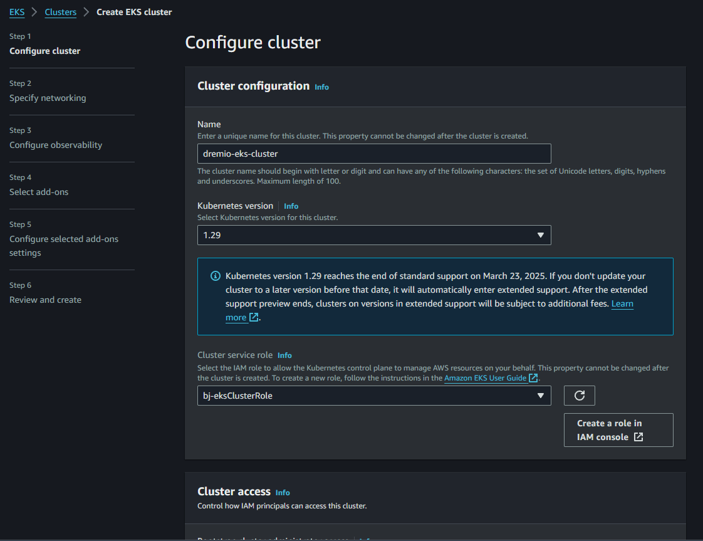

{blank}

Next step

____
VPC :  
____

{blank}

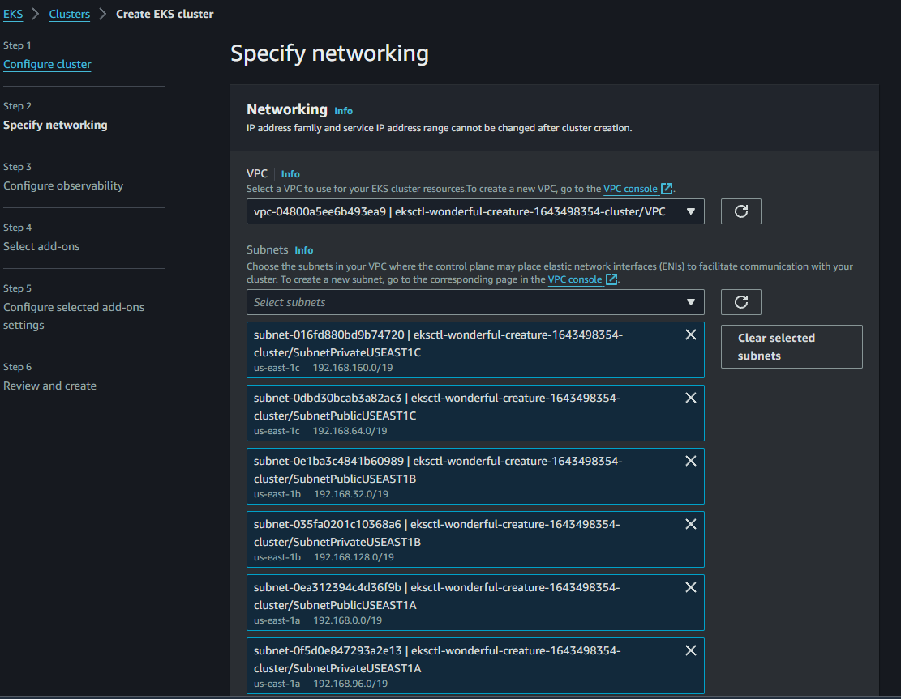

{blank}

Next step

{blank}

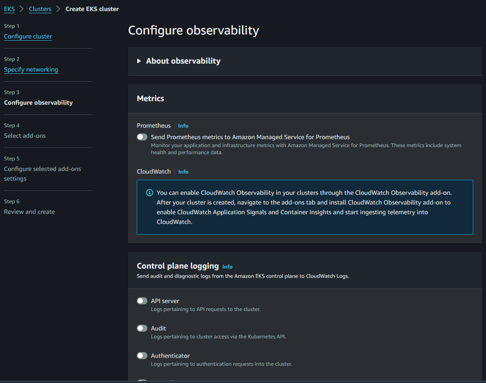

{blank}

Next step

{blank}

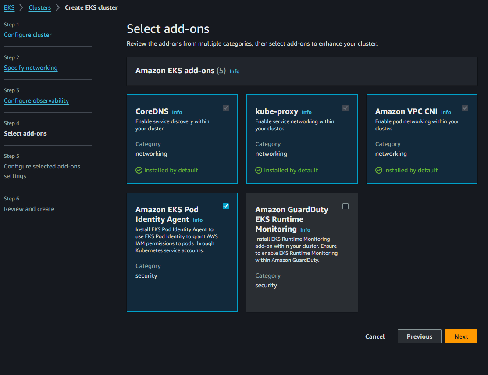

{blank}

Next step

{blank}

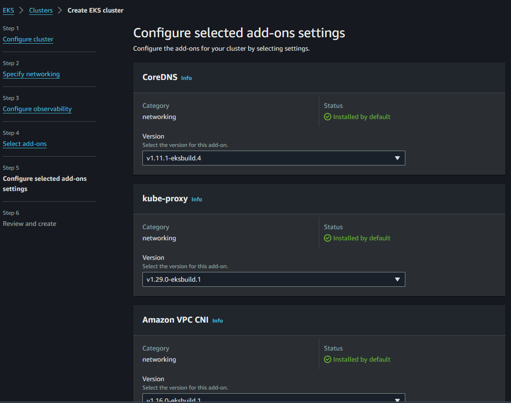

{blank}

Next step

{blank}

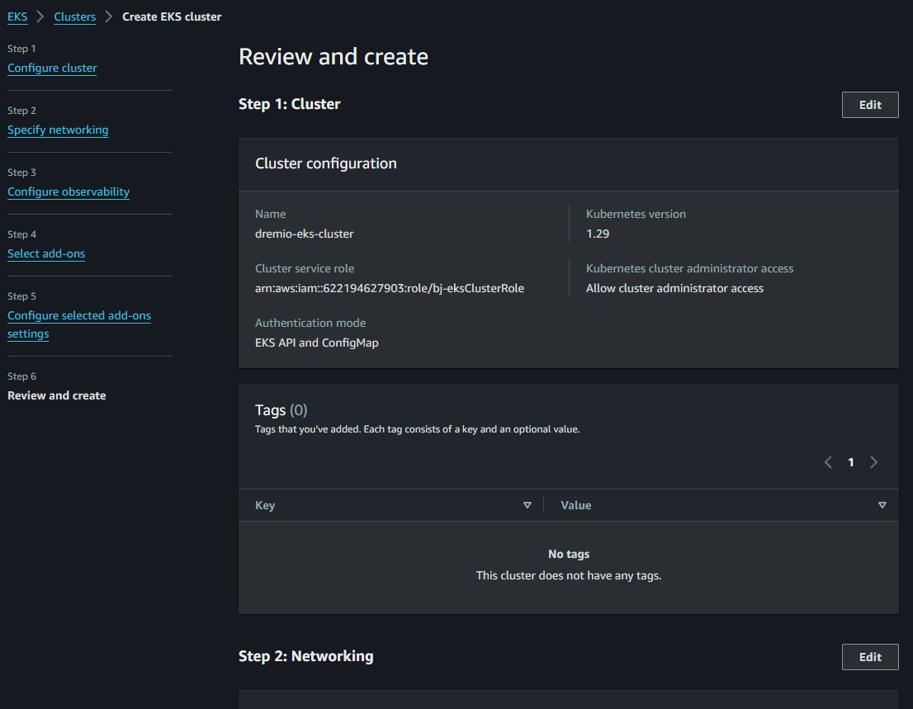

{blank}

Next step

{blank}

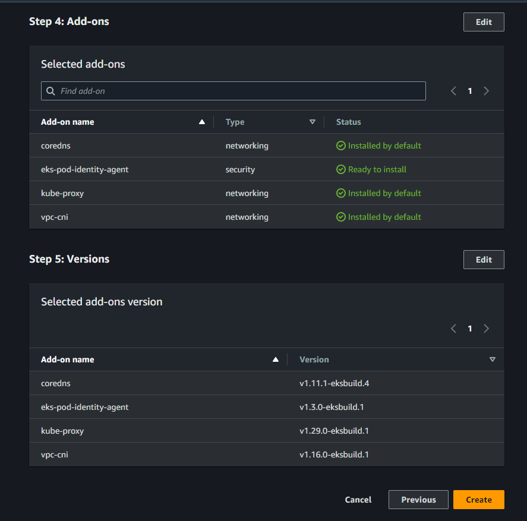

{blank}

Create the cluster

{blank}

After few minutes, you will get the cluster created, up and running :

{blank}

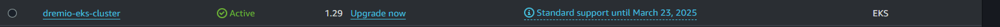

{blank}

== Step 3: Create Node Group

{blank}

Choice the compute folder and click 'add node group' button :

{blank}

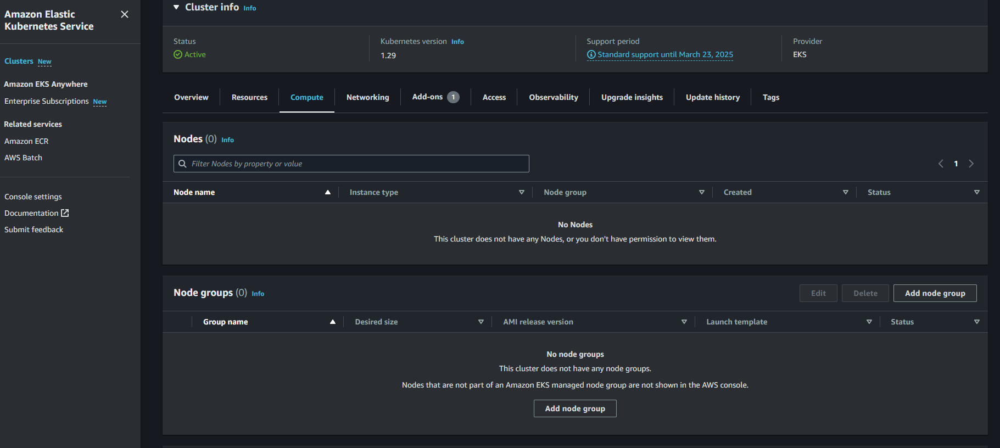

{blank}

Next

{blank}

____
Name : ng01 +
Node IAM role : 1.29 +
Cluster service role : bj-eks-node-role
____

{blank}

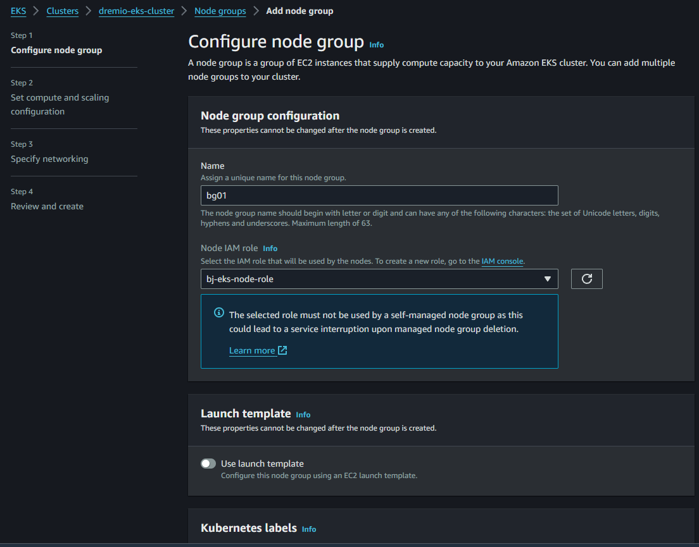

{blank}

Next

{blank}

____
Instance types : m5d.2xlarge +
Disk size : 100 +
Desired size : 1 +
Minimum size : 1 +
Maximum size : 1 +
____

{blank}

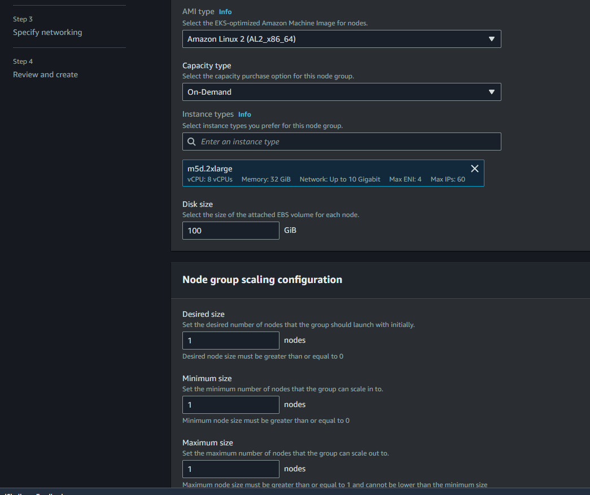

{blank}

Next

{blank}

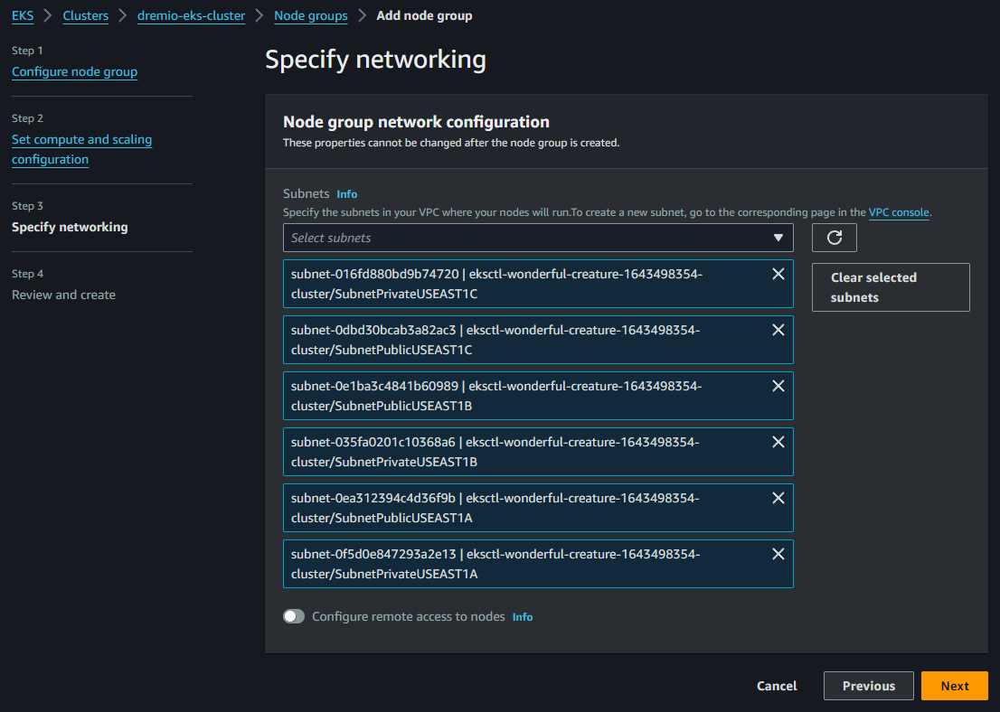

{blank}

Next

{blank}

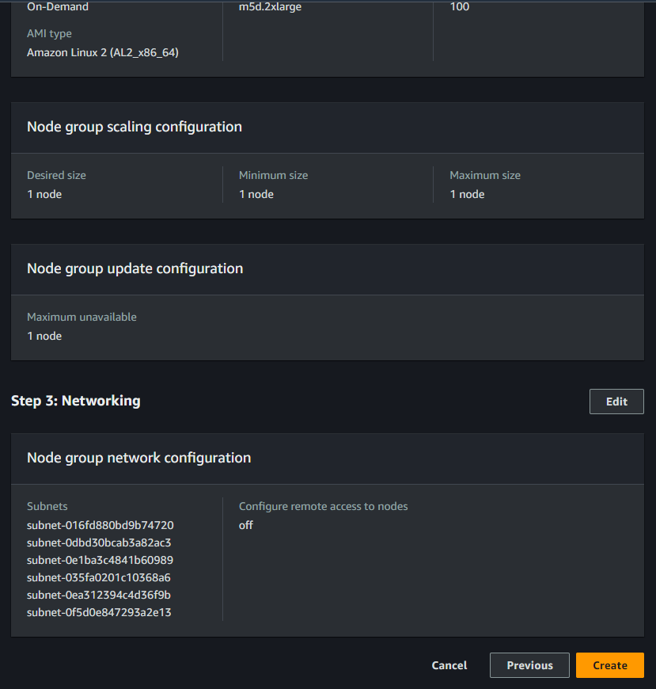

{blank}

Create the Node Group

{blank}

In the end you will get your cluster and node group, up and running.

{blank}

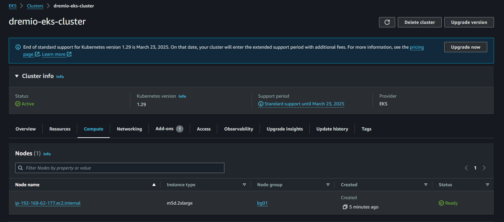

{blank}

Associate IAM with OIDC :

[,console]
----
eksctl utils associate-iam-oidc-provider --region=us-east-1 --cluster=dremio-eks-cluster --approve
----

Configure kubectl localy to your docker instance :

[,console]
----
aws eks update-kubeconfig --region us-east-1 --name dremio-eks-cluster
----

Create IAM Service Account :

[,console]
----
eksctl create iamserviceaccount \
 --name ebs-csi-controller-sa \
 --namespace kube-system \
 --cluster dremio-eks-cluster \
 --attach-policy-arn arn:aws:iam::aws:policy/service-role/AmazonEBSCSIDriverPolicy \
 --approve \
 --role-only \
 --role-name AmazonEKS_EBS_CSI_DriverRole
----

Create addons :

[,console]
----
eksctl create addon --name aws-ebs-csi-driver --cluster dremio-eks-cluster --service-account-role-arn arn:aws:iam::$(aws sts get-caller-identity --query Account --output text):role/AmazonEKS_EBS_CSI_DriverRole --force
----

Check that everything has been well configured :

[,console]
----
eksctl get iamidentitymapping --cluster dremio-eks-cluster
eksctl get iamserviceaccount --cluster dremio-eks-cluster
eksctl get addon --cluster dremio-eks-cluster
----

{blank}

Now let's use Helm to install Dremio on this EKS cluster.

{blank}

== Step 4: Install Dremio

{blank}

Let's use the following Dremio github repository https://github.com/dremio/dremio-cloud-tools/tree/master[dremio-cloud-tools]

{blank}

[,console]
----
git clone https://github.com/dremio/dremio-cloud-tools.git
cd dremio-cloud-tools/charts/dremio_v2/
----

Let's rename the move the existing values.yaml :

[,console]
----
mv values.yaml values.old
----

Now let's create a new values.yaml file, copying the content of following values.yaml :

[,console]
----
vi values.yaml
----

[,console]
----
helm upgrade dr0 . --install
----

{blank}
Get services :

[,console]
----
kubectl get svc

NAME                 TYPE           CLUSTER-IP       EXTERNAL-IP                                                               PORT(S)                                          AGE
dremio-client        LoadBalancer   10.100.167.120   a63aa4689c00a4536bcb5b8fcfa88614-1335824603.us-east-1.elb.amazonaws.com   31010:32379/TCP,9047:31140/TCP,32010:30321/TCP   14m
dremio-cluster-pod   ClusterIP      None             <none>                                                                    9999/TCP                                         14m
kubernetes           ClusterIP      10.100.0.1       <none>                                                                    443/TCP                                          140m
zk-cs                ClusterIP      10.100.182.26    <none>                                                                    2181/TCP
----

In this example open a browser, open a63aa4689c00a4536bcb5b8fcfa88614-1335824603.us-east-1.elb.amazonaws.com:9047.